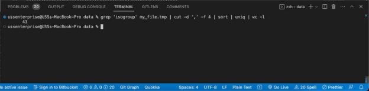

**Tarea 3: TC3\_ForLoop** 

**Nombre:** Ronald Rivera **Curso:** G02 

**Docente:** Moisés Gualapuro 

1. **Next Genera on Sequencing Data** 
1. Change directory to CSB/unix/sandbox.  

2. What is the size of the fileMarra2014\_data.fasta? (553 Kilobytes) 

3. Create a copy of Marra2014\_data.fasta in the sandbox and name it my\_file.fasta.  

4. How many con gs are classified asisogroup00036? (16 configs) 

5. Replace the original "two-spaces" delimiter with a comma. (los 2 espacios son remplazados por la coma en el cat y el head me permite ver las 3 lineas y validar si en comando funciona) 

6. How many unique isogroups are in the file? (43 grupos) 

7. Which con g has the highest number of reads (numreads)? How many reads does it have? (la configuracion 00302) 

2. **Hormone Levels in Baboons**  
1. How many  mes were the levels of individuals 3 and 27 recorded? 

En el nivel 3 hay 61 

En el nivel 27 hay 5 

2. Write a script taking as input the file name and the ID of the individual, and returning the number of records for that ID. 

3. Write a script that returns the number of #  mes each individual was sampled. 

3. **Plant–Pollinator Networks**  
1. Write a script that takes one of these files and determines the number of rows (pollinators) and columns (plants). 

2. Write a script that prints the number of rows and columns for each network 

3. Which is the network with the largest number of rows? Which the one with the largest number of columns? 

El número más grande de las columnas (207 n56.txt) 

El número más grande de las filas (678 n58.txt) 

4. **Data Explorer**  

1\.  Write a script that, for a given csv file and column number, prints: 

- Column name 
- Number of dis nct values 
- Minimum value 
- Maximum value 

**Scripts subidos:** 

h ps://github.com/ronaldso /CSB/tree/TC3\_ForLoop/unix/sandbox/code Rama: TC3\_ForLoop 
